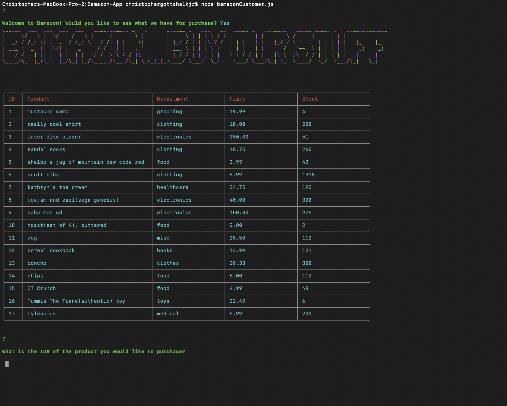
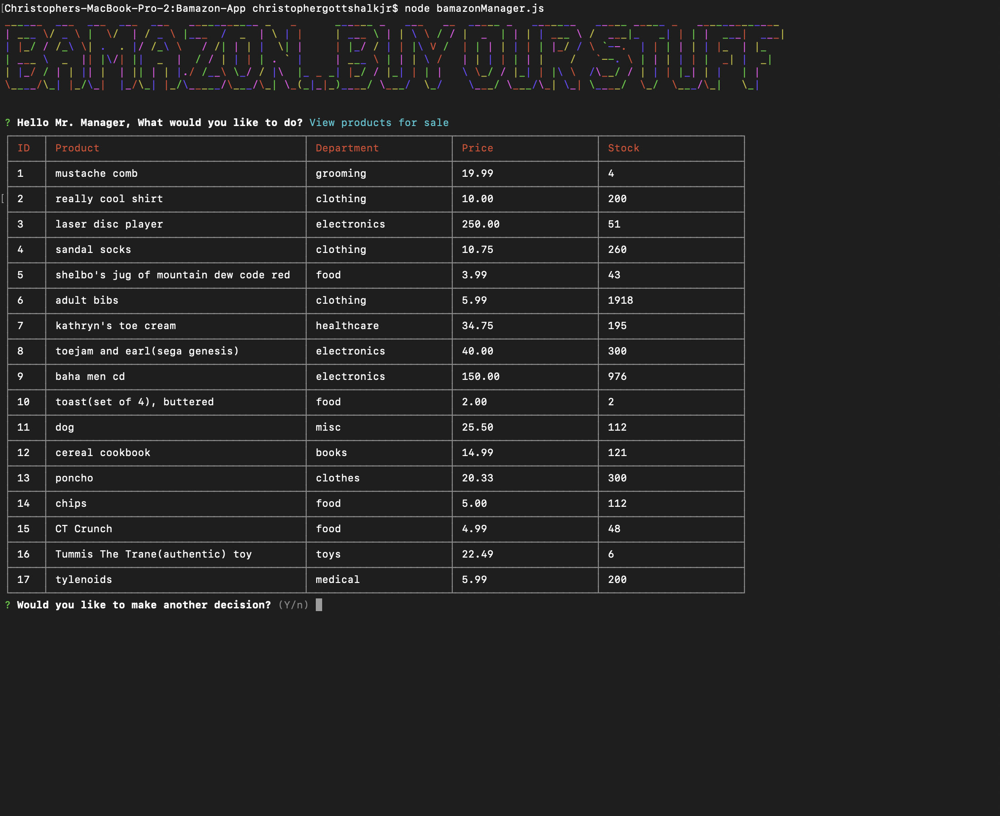
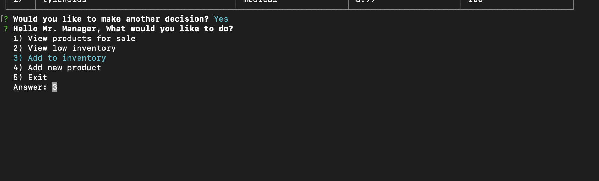
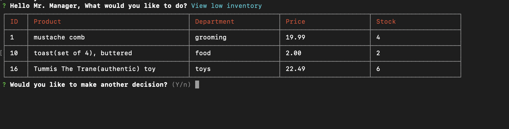
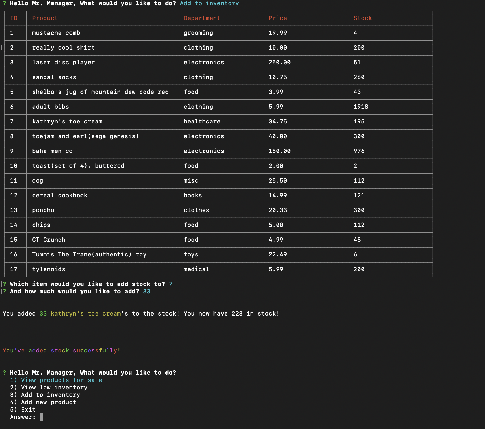
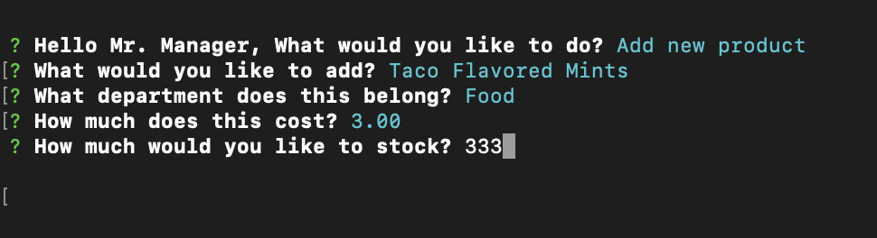
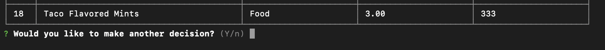
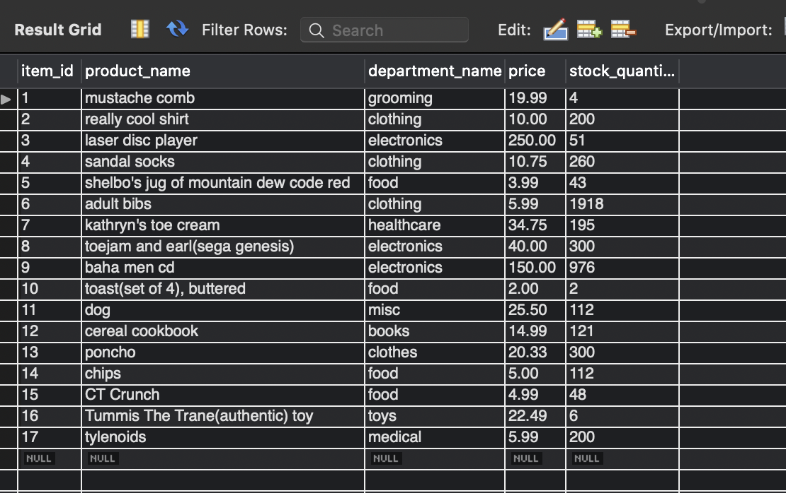

# BAMAZON APP
---
>Created by **Christopher Gottshalk**
---
**BAMAZON** is an node based app where everything comes at the command line. Backed end version of an e-commerce app. It is backed up with MySQL database. The app also uses JavaScript and has multiple node packages installed for a better display. [CHECK OUT THIS VIDEO DEMO OF THE APP](https://drive.google.com/file/d/15LvwzZiid5VaiHn97XJtc3uRL35Uqovw/view)

 ### INSTALL
 ```
 npm install ..all the dependencies are in the package json
 ```


### INSTRUCTIONS 
---
1. Open the app in your terminal. 
2. Make sure to type **node** followed by **bamazonCustomer.js** on the command line
3. Once you hit enter it will run you through a series of commands. Follow these commands. There will be error handling so you can only enter in commands the app asks for!
4. Once you run through the customer app type **node** followed by **bamazonManager.js** on the command line.
5. There will be more options. Again follow the instructions on the screen. 
6. You will be able to add inventory and add new stock items. Everything should render in the table when you bring it up again.
7. Take the code from .sql page from GitHub and put it in your MySQL to watch database update.

---

### Pictures of Game in Action!
---

**Customer view of table when it first comes up**
---
---

**Manager View when table pops up**
---
---

**Manager choices of tasks**
---
---

**Items displaying inew new table that are low in stock**
---
---

**Items been added by Manager to stock**
---
---

**Adding completely new items to table and database**
---
---

**New item added to table**
---
---

**Table in MySQL database**
---
---
### TECHNOLOGIES USED
---
* Javascript
* Nodejs
* MySQL
* Node packages:
* cli-table
* colors
* figlet
* Git
* GitHub
